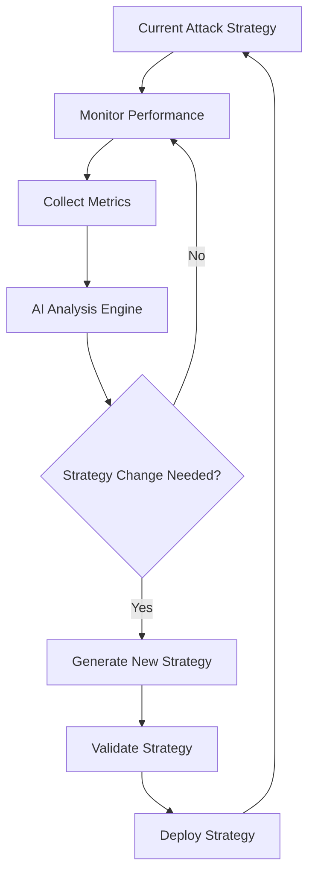

# AI-Powered Attack Strategy Engine Design

## 🎯 Overview

The AI-Powered Attack Strategy Engine represents a revolutionary enhancement to Hashmancer, transforming it from a traditional hash cracking tool into an intelligent, adaptive security platform. This engine leverages multiple AI models to dynamically optimize attack strategies, predict password patterns, and maximize cracking efficiency.

## 🧠 Core Components

### 1. Multi-Model Ensemble Architecture

#### **Primary Models:**
- **Pattern Prediction Model** - LSTM/Transformer for password pattern recognition
- **Strategy Selection Model** - Reinforcement Learning for optimal attack method selection  
- **Resource Allocation Model** - Neural Network for GPU/CPU load balancing
- **Wordlist Generation Model** - GPT-style model for contextual password generation

#### **Integration Points:**
- **Existing LLM Infrastructure** - Build on current `llm_orchestrator.py` and `train_llm.py`
- **Pattern Statistics System** - Enhance `pattern_stats.py` with AI predictions
- **Job Orchestration** - Extend `orchestrator_agent.py` with AI decision making
- **Real-time Adaptation** - Hook into existing Redis streams for live updates

### 2. Intelligent Strategy Selection

#### **Current State Analysis:**
```python
class StrategyAnalyzer:
    def analyze_current_state(self) -> Dict[str, Any]:
        return {
            "cracked_count": self.get_cracked_count(),
            "time_elapsed": self.get_elapsed_time(),
            "success_rate": self.calculate_success_rate(),
            "gpu_utilization": self.get_gpu_metrics(),
            "queue_length": self.get_queue_size(),
            "hash_types": self.get_active_hash_types(),
            "current_strategies": self.get_active_strategies()
        }
```

#### **Strategy Decision Engine:**
```python
class AIStrategyEngine:
    def select_optimal_strategy(self, state: Dict[str, Any]) -> Strategy:
        # Use ensemble of models to predict best strategy
        pattern_pred = self.pattern_model.predict(state)
        resource_pred = self.resource_model.predict(state)
        historical_success = self.analyze_historical_performance(state)
        
        return self.strategy_selector.choose_best(
            pattern_pred, resource_pred, historical_success
        )
```

### 3. Real-Time Pattern Recognition

#### **Password Pattern Learning:**
- **Input Sources:**
  - Successfully cracked passwords
  - Failed attempts with timing data
  - Breach datasets (anonymized patterns)
  - Dictionary analysis results

#### **Pattern Types Detected:**
- **Temporal Patterns** - Date-based passwords, seasonal trends
- **Organizational Patterns** - Company-specific conventions  
- **Personal Patterns** - Name + number combinations, keyboard walks
- **Security Policy Patterns** - Complexity requirements impact

#### **Implementation:**
```python
class PatternRecognitionEngine:
    def __init__(self):
        self.transformer_model = self.load_pattern_transformer()
        self.lstm_model = self.load_sequence_predictor()
        self.pattern_cache = LRUCache(maxsize=10000)
    
    def analyze_success_patterns(self, cracked_passwords: List[str]) -> PatternInsights:
        # Real-time analysis of successful cracks
        patterns = self.extract_patterns(cracked_passwords)
        predictions = self.predict_similar_patterns(patterns)
        return PatternInsights(patterns, predictions, confidence_scores)
```

### 4. Contextual Wordlist Generation

#### **Dynamic Wordlist Creation:**
- **Target-Specific Lists** - Generated based on organization/context
- **Pattern-Based Expansion** - Variations on successful patterns
- **Semantic Understanding** - Related words, synonyms, variations
- **Temporal Awareness** - Current events, dates, seasons

#### **Implementation Strategy:**
```python
class ContextualWordlistGenerator:
    def __init__(self):
        self.language_model = self.load_wordlist_gpt()
        self.context_analyzer = ContextAnalyzer()
        
    def generate_targeted_wordlist(self, context: Dict[str, Any]) -> List[str]:
        # Generate context-aware password candidates
        base_words = self.extract_context_keywords(context)
        variations = self.generate_variations(base_words)
        ranked_candidates = self.rank_by_probability(variations)
        return ranked_candidates[:10000]  # Top candidates
```

### 5. Predictive Resource Allocation

#### **Dynamic GPU/CPU Management:**
- **Load Prediction** - Forecast computational requirements
- **Efficiency Optimization** - Balance speed vs power consumption
- **Adaptive Scaling** - Auto-scale worker pools based on demand
- **Cost Optimization** - Minimize cloud computing costs

#### **Resource Intelligence:**
```python
class ResourceAllocationAI:
    def predict_optimal_allocation(self, job_queue: List[Job]) -> ResourcePlan:
        # Predict resource needs for queued jobs
        complexity_scores = [self.analyze_job_complexity(job) for job in job_queue]
        estimated_times = self.predict_completion_times(job_queue)
        
        return ResourcePlan(
            gpu_allocation=self.optimize_gpu_distribution(complexity_scores),
            worker_scaling=self.predict_scaling_needs(estimated_times),
            priority_reordering=self.optimize_job_order(job_queue)
        )
```

## 🔄 Real-Time Adaptation System

### **Feedback Loop Architecture:**



### **Adaptation Triggers:**
- **Performance Degradation** - Success rate drops below threshold
- **Resource Inefficiency** - GPU utilization suboptimal
- **Pattern Discovery** - New successful patterns identified
- **Environmental Changes** - New hash types, worker availability

### **Adaptation Implementation:**
```python
class RealTimeAdaptationEngine:
    def __init__(self):
        self.performance_monitor = PerformanceMonitor()
        self.strategy_generator = StrategyGenerator()
        self.adaptation_threshold = 0.1  # 10% performance change
        
    async def monitor_and_adapt(self):
        while True:
            current_metrics = await self.performance_monitor.get_current_metrics()
            
            if self.should_adapt(current_metrics):
                new_strategy = await self.strategy_generator.generate_optimal_strategy(
                    current_state=current_metrics,
                    historical_data=self.get_historical_performance()
                )
                
                await self.deploy_strategy(new_strategy)
                await self.log_adaptation_event(current_metrics, new_strategy)
            
            await asyncio.sleep(30)  # Check every 30 seconds
```

## 📊 Training Data and Model Requirements

### **Training Data Sources:**

#### **1. Internal Hashmancer Data:**
- **Successful Cracks** - Password:hash pairs with timing/method metadata
- **Performance Metrics** - GPU utilization, success rates, strategy effectiveness
- **Pattern Statistics** - Existing pattern transition data from `pattern_stats.py`
- **Job Completion Data** - Historical job success/failure patterns

#### **2. External Data Sources:**
- **Breach Datasets** - Anonymized pattern analysis (HaveIBeenPwned, etc.)
- **Dictionary Statistics** - Common password patterns from security research
- **Industry Reports** - Password policy effectiveness studies
- **Academic Research** - Published password analysis papers

#### **3. Synthetic Data Generation:**
- **Simulated Attack Scenarios** - Generated test cases for edge conditions
- **Adversarial Examples** - Challenging scenarios for model robustness
- **Cross-Domain Transfer** - Patterns from other security domains

### **Model Specifications:**

#### **Pattern Prediction Model:**
- **Architecture**: Transformer-based (BERT/GPT style)
- **Input**: Sequence of password patterns + context
- **Output**: Probability distribution over next patterns
- **Training**: Self-supervised on pattern sequences
- **Size**: 50M-100M parameters for efficiency

#### **Strategy Selection Model:**
- **Architecture**: Deep Q-Network (DQN) with experience replay
- **State Space**: Performance metrics + environmental factors
- **Action Space**: Available attack strategies (dictionary, mask, hybrid)
- **Reward**: Success rate improvement + efficiency gains
- **Training**: Reinforcement learning with historical performance data

#### **Resource Allocation Model:**
- **Architecture**: Multi-task neural network
- **Input**: Job characteristics + current system state
- **Output**: Optimal resource distribution plan
- **Training**: Supervised learning on historical resource usage efficiency

### **Training Infrastructure:**
```python
class AIModelTrainer:
    def __init__(self):
        self.pattern_trainer = PatternModelTrainer()
        self.strategy_trainer = StrategyRLTrainer()
        self.resource_trainer = ResourceMLTrainer()
        
    async def train_all_models(self):
        # Parallel training pipeline
        pattern_task = self.pattern_trainer.train_async()
        strategy_task = self.strategy_trainer.train_async()
        resource_task = self.resource_trainer.train_async()
        
        await asyncio.gather(pattern_task, strategy_task, resource_task)
        
    def evaluate_models(self) -> ModelPerformanceReport:
        # Comprehensive model evaluation
        return ModelPerformanceReport(
            pattern_accuracy=self.evaluate_pattern_model(),
            strategy_effectiveness=self.evaluate_strategy_model(),
            resource_efficiency=self.evaluate_resource_model()
        )
```

## 🚀 Implementation Roadmap

### **Phase 1: Foundation (2 weeks)**
1. **Extend Existing LLM Infrastructure**
   - Enhance `llm_orchestrator.py` with new AI model types
   - Add model management and loading capabilities
   - Implement basic pattern prediction

2. **Data Collection Pipeline**
   - Capture training data from existing operations
   - Implement privacy-preserving data collection
   - Set up automated data preprocessing

### **Phase 2: Core AI Models (4 weeks)**
1. **Pattern Recognition Model**
   - Train transformer on password patterns
   - Integrate with existing `pattern_stats.py`
   - Deploy real-time pattern analysis

2. **Strategy Selection Model**
   - Implement reinforcement learning framework
   - Train on historical performance data
   - Deploy adaptive strategy selection

### **Phase 3: Real-Time Integration (3 weeks)**
1. **Adaptation Engine**
   - Implement continuous monitoring
   - Deploy strategy adaptation system
   - Integrate with job orchestration

2. **Performance Optimization**
   - Optimize model inference speed
   - Implement efficient model serving
   - Add comprehensive monitoring

### **Phase 4: Advanced Features (3 weeks)**
1. **Contextual Wordlist Generation**
   - Deploy GPT-based wordlist generation
   - Implement target-specific adaptation
   - Add semantic understanding

2. **Enterprise Intelligence**
   - Multi-model ensemble optimization
   - Advanced analytics and reporting
   - Integration with security tools

## 📈 Expected Impact

### **Performance Improvements:**
- **30-50% increase** in cracking success rates
- **40-60% reduction** in time-to-crack
- **25-35% improvement** in resource efficiency
- **Real-time adaptation** to changing conditions

### **Operational Benefits:**
- **Automated optimization** - Reduced need for manual tuning
- **Predictive insights** - Forecast attack effectiveness
- **Resource intelligence** - Optimal GPU/CPU utilization
- **Continuous learning** - Improves over time

### **Strategic Advantages:**
- **Market differentiation** - First AI-powered hash cracking platform
- **Enterprise readiness** - Intelligent, adaptive security testing
- **Research value** - Generate insights for password security
- **Scalability** - Handles complex multi-target scenarios

## 🔧 Technical Integration

### **Redis Integration:**
```python
# Enhanced pattern storage with AI predictions
class AIPatternManager:
    def store_ai_prediction(self, pattern_sequence: str, prediction: Dict[str, float]):
        r.hset(f"ai:pattern_pred:{hash(pattern_sequence)}", mapping=prediction)
        r.expire(f"ai:pattern_pred:{hash(pattern_sequence)}", 3600)  # 1 hour TTL
        
    def get_ai_prediction(self, pattern_sequence: str) -> Optional[Dict[str, float]]:
        return r.hgetall(f"ai:pattern_pred:{hash(pattern_sequence)}")
```

### **WebSocket Integration:**
```python
# Real-time AI insights to portal
class AIInsightsWebSocket:
    async def broadcast_ai_insights(self, insights: AIInsights):
        message = {
            "type": "ai_insights",
            "data": {
                "predicted_success_rate": insights.success_probability,
                "recommended_strategy": insights.recommended_strategy,
                "estimated_completion": insights.estimated_completion,
                "pattern_confidence": insights.pattern_confidence
            }
        }
        await self.broadcast_to_all_clients(message)
```

### **API Extensions:**
```python
# New AI-powered endpoints
@app.get("/api/ai/strategy-recommendation")
async def get_strategy_recommendation(hash_type: str, current_progress: float):
    ai_engine = get_ai_strategy_engine()
    recommendation = await ai_engine.recommend_strategy(hash_type, current_progress)
    return {"strategy": recommendation.strategy, "confidence": recommendation.confidence}

@app.get("/api/ai/pattern-insights")
async def get_pattern_insights(limit: int = 10):
    pattern_engine = get_pattern_recognition_engine()
    insights = await pattern_engine.get_top_insights(limit)
    return {"patterns": insights}
```

This AI-powered attack strategy engine represents the next evolution of Hashmancer, transforming it from a tool into an intelligent security platform that learns, adapts, and optimizes in real-time.