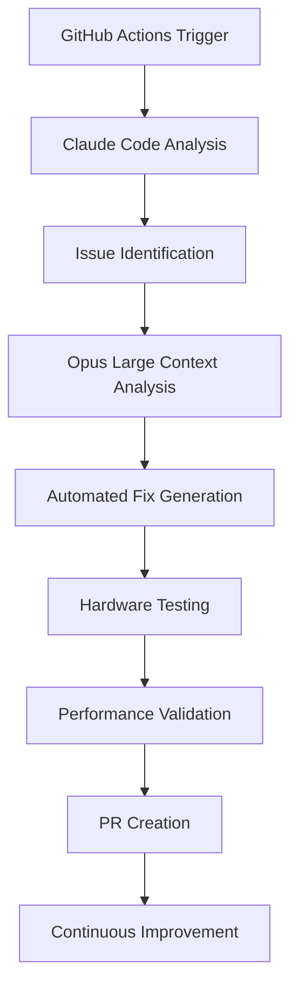

# 🧠 Claude Opus Integration Workflow for Automated Development

## Overview

This document outlines a comprehensive strategy for using Claude Opus (200K context) to automatically analyze, fix, and improve the Hashmancer codebase with hardware-aware testing and continuous development.

---

## 🎯 Integration Architecture



---

## 🔧 Phase 1: Automated Issue Detection & Analysis

### 1.1 GitHub Actions Trigger System

**File**: `.github/workflows/opus-analysis.yml`

```yaml
name: Opus Automated Development

on:
  schedule:
    - cron: '0 6 * * *'  # Daily at 6 AM
  workflow_dispatch:
    inputs:
      analysis_type:
        description: 'Analysis Type'
        required: true
        default: 'security'
        type: choice
        options:
          - security
          - performance
          - testing
          - architecture
          - full-audit
      priority_level:
        description: 'Priority Level'
        required: true
        default: 'high'
        type: choice
        options:
          - critical
          - high
          - medium
          - low
  push:
    branches: [main]
    paths:
      - 'hashmancer/**'
      - 'tests/**'
```

### 1.2 Intelligent Code Collection System

**File**: `scripts/opus-code-collector.py`

```python
#!/usr/bin/env python3
"""
Intelligent code collector for Opus analysis
Optimizes file selection for 200K context window
"""

import os
import ast
import json
from pathlib import Path
from typing import Dict, List, Tuple

class OpusCodeCollector:
    def __init__(self, max_tokens: int = 180000):  # Reserve 20K for analysis
        self.max_tokens = max_tokens
        self.current_tokens = 0
        
    def collect_for_analysis(self, analysis_type: str) -> Dict[str, str]:
        """Collect relevant files based on analysis type"""
        
        if analysis_type == "security":
            return self._collect_security_context()
        elif analysis_type == "performance":
            return self._collect_performance_context()
        elif analysis_type == "testing":
            return self._collect_testing_context()
        elif analysis_type == "architecture":
            return self._collect_architecture_context()
        else:
            return self._collect_full_context()
    
    def _collect_security_context(self) -> Dict[str, str]:
        """Collect security-relevant files with dependencies"""
        priority_files = [
            "hashmancer/server/security/",
            "hashmancer/server/auth_middleware.py",
            "hashmancer/server/auth_utils.py",
            "tests/test_auth_middleware.py",
            "Dockerfile*",
            "docker-compose*.yml"
        ]
        return self._smart_collect(priority_files)
    
    def _smart_collect(self, patterns: List[str]) -> Dict[str, str]:
        """Smart collection with dependency analysis"""
        collected = {}
        
        # Phase 1: Collect primary files
        for pattern in patterns:
            files = self._find_files(pattern)
            for file_path in files:
                if self._should_include(file_path):
                    content = self._read_file(file_path)
                    if self._fits_in_budget(content):
                        collected[file_path] = content
                        
        # Phase 2: Add dependencies based on imports
        dependencies = self._analyze_dependencies(collected)
        for dep_path in dependencies:
            if dep_path not in collected:
                content = self._read_file(dep_path)
                if self._fits_in_budget(content):
                    collected[dep_path] = content
                    
        return collected
```

### 1.3 Context-Aware Analysis Prompts

**File**: `scripts/opus-prompts.json`

```json
{
  "security_analysis": {
    "prompt": "Analyze this Hashmancer codebase for security vulnerabilities. Focus on:\n1. Authentication and authorization flaws\n2. Input validation bypasses\n3. Container security issues\n4. Dependency vulnerabilities\n5. Session management weaknesses\n\nFor each issue found:\n- Provide exact file:line location\n- Explain the vulnerability and impact\n- Suggest specific code fixes\n- Include test cases to validate the fix\n- Estimate fix complexity (1-5 scale)",
    "max_fixes": 10,
    "priority": "critical"
  },
  "performance_analysis": {
    "prompt": "Analyze this Hashmancer codebase for performance bottlenecks. Focus on:\n1. Async/sync operation mismatches\n2. Database query optimization\n3. Memory leaks and resource management\n4. GPU utilization efficiency\n5. Network and I/O optimization\n\nFor each optimization:\n- Provide benchmarking approach\n- Suggest specific improvements\n- Include performance test cases\n- Estimate performance impact",
    "max_fixes": 8,
    "priority": "high"
  },
  "testing_strategy": {
    "prompt": "Analyze this Hashmancer codebase and create comprehensive testing strategy. Focus on:\n1. Test coverage gaps\n2. Missing test categories (security, performance, chaos)\n3. Flaky test identification\n4. Test infrastructure improvements\n5. CI/CD optimization\n\nProvide:\n- Specific test files to create\n- Test case implementations\n- Mock and fixture strategies\n- Integration testing improvements",
    "max_fixes": 15,
    "priority": "medium"
  }
}
```

---

## 🤖 Phase 2: Opus Integration Pipeline

### 2.1 Automated API Integration

**File**: `scripts/opus-client.py`

```python
#!/usr/bin/env python3
"""
Claude Opus API client for automated development
"""

import anthropic
import json
import os
from typing import Dict, List, Optional
from dataclasses import dataclass

@dataclass
class FixRecommendation:
    file_path: str
    line_number: int
    issue_type: str
    severity: str
    description: str
    fix_code: str
    test_code: str
    complexity: int

class OpusClient:
    def __init__(self):
        self.client = anthropic.Anthropic(
            api_key=os.getenv('ANTHROPIC_API_KEY')
        )
        
    def analyze_codebase(
        self, 
        files: Dict[str, str], 
        analysis_type: str
    ) -> List[FixRecommendation]:
        """Send codebase to Opus for analysis"""
        
        # Load analysis prompt
        with open('scripts/opus-prompts.json', 'r') as f:
            prompts = json.load(f)
        
        prompt_config = prompts[f"{analysis_type}_analysis"]
        
        # Prepare context
        context = self._build_context(files)
        full_prompt = f"{prompt_config['prompt']}\n\n{context}"
        
        # Send to Opus
        response = self.client.messages.create(
            model="claude-3-opus-20240229",
            max_tokens=4000,
            messages=[{
                "role": "user",
                "content": full_prompt
            }]
        )
        
        # Parse response into structured recommendations
        return self._parse_recommendations(response.content)
    
    def _build_context(self, files: Dict[str, str]) -> str:
        """Build context string optimized for Opus"""
        context_parts = []
        
        # Add file tree overview
        context_parts.append("## Codebase Structure")
        for file_path in sorted(files.keys()):
            context_parts.append(f"- {file_path}")
        
        # Add file contents
        context_parts.append("\n## File Contents")
        for file_path, content in files.items():
            context_parts.append(f"\n### {file_path}")
            context_parts.append(f"```python\n{content}\n```")
        
        # Add current issues context
        context_parts.append(self._load_current_issues())
        
        return "\n".join(context_parts)
    
    def _parse_recommendations(self, response: str) -> List[FixRecommendation]:
        """Parse Opus response into structured recommendations"""
        recommendations = []
        
        # Implementation would parse structured response
        # This is a simplified version
        lines = response.split('\n')
        current_rec = None
        
        for line in lines:
            if line.startswith('## Issue:'):
                if current_rec:
                    recommendations.append(current_rec)
                current_rec = self._start_new_recommendation(line)
            elif current_rec and line.startswith('File:'):
                current_rec.file_path = line.split(':', 1)[1].strip()
            # ... more parsing logic
        
        return recommendations
```

### 2.2 Automated Fix Application

**File**: `scripts/opus-fix-applier.py`

```python
#!/usr/bin/env python3
"""
Applies Opus-generated fixes with validation
"""

import subprocess
import tempfile
import shutil
from pathlib import Path
from typing import List
from opus_client import FixRecommendation

class OpusFixApplier:
    def __init__(self, repo_path: str):
        self.repo_path = Path(repo_path)
        
    def apply_fixes(
        self, 
        recommendations: List[FixRecommendation], 
        max_fixes: int = 5
    ) -> Dict[str, bool]:
        """Apply fixes with validation and rollback capability"""
        
        results = {}
        applied_fixes = []
        
        # Sort by severity and complexity
        sorted_recs = sorted(
            recommendations[:max_fixes],
            key=lambda x: (x.severity, x.complexity)
        )
        
        for rec in sorted_recs:
            try:
                # Create backup
                backup_path = self._create_backup(rec.file_path)
                
                # Apply fix
                if self._apply_single_fix(rec):
                    # Validate fix
                    if self._validate_fix(rec):
                        applied_fixes.append(rec)
                        results[f"{rec.file_path}:{rec.line_number}"] = True
                    else:
                        # Rollback on validation failure
                        self._restore_backup(backup_path, rec.file_path)
                        results[f"{rec.file_path}:{rec.line_number}"] = False
                else:
                    results[f"{rec.file_path}:{rec.line_number}"] = False
                    
            except Exception as e:
                print(f"Error applying fix {rec.file_path}:{rec.line_number}: {e}")
                results[f"{rec.file_path}:{rec.line_number}"] = False
        
        return results
    
    def _validate_fix(self, rec: FixRecommendation) -> bool:
        """Validate applied fix through multiple checks"""
        
        # 1. Syntax validation
        if not self._check_syntax(rec.file_path):
            return False
            
        # 2. Run specific tests
        if not self._run_fix_tests(rec):
            return False
            
        # 3. Run impacted tests
        if not self._run_impacted_tests(rec.file_path):
            return False
            
        return True
    
    def _run_fix_tests(self, rec: FixRecommendation) -> bool:
        """Run tests specific to the fix"""
        if rec.test_code:
            # Create temporary test file
            test_file = f"/tmp/test_fix_{rec.file_path.replace('/', '_')}.py"
            with open(test_file, 'w') as f:
                f.write(rec.test_code)
            
            # Run the test
            result = subprocess.run([
                'python', '-m', 'pytest', test_file, '-v'
            ], capture_output=True)
            
            return result.returncode == 0
        
        return True  # No test provided, assume valid
```

---

## 🧪 Phase 3: Hardware-Aware Testing Integration

### 3.1 GPU-Aware Test Orchestration

**File**: `scripts/hardware-test-orchestrator.py`

```python
#!/usr/bin/env python3
"""
Hardware-aware testing for Opus-generated fixes
"""

import asyncio
import subprocess
import json
from typing import Dict, List, Optional
from dataclasses import dataclass

@dataclass
class HardwareConfig:
    gpu_count: int
    gpu_memory: int
    cpu_cores: int
    total_memory: int
    has_cuda: bool
    has_docker: bool

class HardwareTestOrchestrator:
    def __init__(self):
        self.hardware_config = self._detect_hardware()
        
    def run_comprehensive_tests(
        self, 
        applied_fixes: List[FixRecommendation]
    ) -> Dict[str, Dict[str, bool]]:
        """Run hardware-specific tests for applied fixes"""
        
        results = {
            'unit_tests': {},
            'integration_tests': {},
            'performance_tests': {},
            'gpu_tests': {},
            'stress_tests': {}
        }
        
        # Run test categories based on fix types
        for fix in applied_fixes:
            if fix.issue_type == 'security':
                results['unit_tests'].update(
                    self._run_security_tests(fix)
                )
            elif fix.issue_type == 'performance':
                results['performance_tests'].update(
                    self._run_performance_tests(fix)
                )
            elif fix.issue_type == 'gpu':
                results['gpu_tests'].update(
                    self._run_gpu_tests(fix)
                )
        
        # Always run core integration tests
        results['integration_tests'] = self._run_integration_tests()
        
        # Run stress tests if hardware supports it
        if self._can_run_stress_tests():
            results['stress_tests'] = self._run_stress_tests()
        
        return results
    
    def _run_gpu_tests(self, fix: FixRecommendation) -> Dict[str, bool]:
        """Run GPU-specific tests with hardware awareness"""
        if not self.hardware_config.has_cuda:
            return {'gpu_tests_skipped': True}
        
        tests = {}
        
        # GPU memory test
        tests['gpu_memory_test'] = self._test_gpu_memory_usage()
        
        # CUDA kernel test
        tests['cuda_kernel_test'] = self._test_cuda_kernels()
        
        # Multi-GPU test (if available)
        if self.hardware_config.gpu_count > 1:
            tests['multi_gpu_test'] = self._test_multi_gpu()
        
        # GPU worker test
        tests['gpu_worker_test'] = self._test_gpu_worker_integration()
        
        return tests
    
    def _run_performance_tests(self, fix: FixRecommendation) -> Dict[str, bool]:
        """Run performance tests with benchmarking"""
        tests = {}
        
        # Redis performance test
        redis_perf = self._benchmark_redis_operations()
        tests['redis_performance'] = redis_perf['average_latency'] < 5.0  # ms
        
        # API response time test
        api_perf = self._benchmark_api_endpoints()
        tests['api_performance'] = api_perf['p95_latency'] < 200.0  # ms
        
        # Memory usage test
        memory_usage = self._benchmark_memory_usage()
        tests['memory_efficiency'] = memory_usage['peak_usage'] < 2048  # MB
        
        return tests
    
    async def _run_load_tests(self) -> Dict[str, bool]:
        """Run concurrent load tests"""
        load_results = {}
        
        # Simulate multiple workers
        worker_tasks = []
        for i in range(min(4, self.hardware_config.cpu_cores)):
            task = asyncio.create_task(self._simulate_worker_load(i))
            worker_tasks.append(task)
        
        # Run load for 60 seconds
        await asyncio.sleep(60)
        
        # Collect results
        results = await asyncio.gather(*worker_tasks, return_exceptions=True)
        
        load_results['worker_stability'] = all(
            not isinstance(r, Exception) for r in results
        )
        
        return load_results
```

### 3.2 Real-time Performance Monitoring

**File**: `scripts/performance-monitor.py`

```python
#!/usr/bin/env python3
"""
Real-time performance monitoring during testing
"""

import psutil
import subprocess
import time
import json
from typing import Dict, List
from threading import Thread
import matplotlib.pyplot as plt

class PerformanceMonitor:
    def __init__(self):
        self.metrics = []
        self.monitoring = False
        
    def start_monitoring(self, duration: int = 300):
        """Start continuous performance monitoring"""
        self.monitoring = True
        monitor_thread = Thread(target=self._monitor_loop, args=(duration,))
        monitor_thread.start()
        
    def _monitor_loop(self, duration: int):
        """Main monitoring loop"""
        start_time = time.time()
        
        while self.monitoring and (time.time() - start_time) < duration:
            metrics = self._collect_metrics()
            self.metrics.append(metrics)
            
            # Log critical issues immediately
            if metrics['memory_percent'] > 90:
                print(f"⚠️ High memory usage: {metrics['memory_percent']}%")
            
            if metrics['cpu_percent'] > 95:
                print(f"⚠️ High CPU usage: {metrics['cpu_percent']}%")
            
            if metrics.get('gpu_memory_percent', 0) > 95:
                print(f"⚠️ High GPU memory: {metrics['gpu_memory_percent']}%")
            
            time.sleep(5)  # Collect every 5 seconds
    
    def _collect_metrics(self) -> Dict:
        """Collect system metrics"""
        metrics = {
            'timestamp': time.time(),
            'cpu_percent': psutil.cpu_percent(interval=1),
            'memory_percent': psutil.virtual_memory().percent,
            'disk_io': psutil.disk_io_counters()._asdict(),
            'network_io': psutil.net_io_counters()._asdict(),
        }
        
        # GPU metrics (if available)
        try:
            gpu_info = subprocess.check_output([
                'nvidia-smi', '--query-gpu=memory.used,memory.total,utilization.gpu',
                '--format=csv,noheader,nounits'
            ], text=True)
            
            gpu_lines = gpu_info.strip().split('\n')
            for i, line in enumerate(gpu_lines):
                used, total, util = line.split(', ')
                metrics[f'gpu_{i}_memory_used'] = int(used)
                metrics[f'gpu_{i}_memory_total'] = int(total)
                metrics[f'gpu_{i}_memory_percent'] = (int(used) / int(total)) * 100
                metrics[f'gpu_{i}_utilization'] = int(util)
                
        except (subprocess.CalledProcessError, FileNotFoundError):
            pass  # No GPU or nvidia-smi not available
        
        # Docker metrics (if containers running)
        try:
            docker_stats = subprocess.check_output([
                'docker', 'stats', '--no-stream', '--format',
                'table {{.Container}},{{.CPUPerc}},{{.MemUsage}}'
            ], text=True)
            
            metrics['docker_containers'] = self._parse_docker_stats(docker_stats)
            
        except subprocess.CalledProcessError:
            pass  # Docker not available or no containers
        
        return metrics
    
    def generate_report(self) -> Dict:
        """Generate performance report"""
        if not self.metrics:
            return {'error': 'No metrics collected'}
        
        # Calculate statistics
        cpu_avg = sum(m['cpu_percent'] for m in self.metrics) / len(self.metrics)
        memory_avg = sum(m['memory_percent'] for m in self.metrics) / len(self.metrics)
        
        cpu_max = max(m['cpu_percent'] for m in self.metrics)
        memory_max = max(m['memory_percent'] for m in self.metrics)
        
        report = {
            'duration': len(self.metrics) * 5,  # 5 second intervals
            'cpu_average': cpu_avg,
            'cpu_maximum': cpu_max,
            'memory_average': memory_avg,
            'memory_maximum': memory_max,
            'performance_grade': self._calculate_grade(cpu_avg, memory_avg),
            'recommendations': self._generate_recommendations(cpu_avg, memory_avg)
        }
        
        # Add GPU stats if available
        gpu_metrics = [m for m in self.metrics if any(k.startswith('gpu_') for k in m.keys())]
        if gpu_metrics:
            gpu_util_avg = sum(
                m.get('gpu_0_utilization', 0) for m in gpu_metrics
            ) / len(gpu_metrics)
            report['gpu_utilization_average'] = gpu_util_avg
        
        return report
    
    def save_performance_chart(self, filename: str = 'performance_chart.png'):
        """Save performance chart"""
        if not self.metrics:
            return
        
        timestamps = [m['timestamp'] for m in self.metrics]
        cpu_data = [m['cpu_percent'] for m in self.metrics]
        memory_data = [m['memory_percent'] for m in self.metrics]
        
        plt.figure(figsize=(12, 8))
        
        plt.subplot(2, 1, 1)
        plt.plot(timestamps, cpu_data, 'b-', label='CPU %')
        plt.ylabel('CPU Percentage')
        plt.legend()
        plt.grid(True)
        
        plt.subplot(2, 1, 2)
        plt.plot(timestamps, memory_data, 'r-', label='Memory %')
        plt.ylabel('Memory Percentage')
        plt.xlabel('Time')
        plt.legend()
        plt.grid(True)
        
        plt.tight_layout()
        plt.savefig(filename, dpi=300, bbox_inches='tight')
        plt.close()
```

---

## 🔄 Phase 4: Continuous Improvement Loop

### 4.1 Automated PR Creation and Management

**File**: `scripts/opus-pr-manager.py`

```python
#!/usr/bin/env python3
"""
Automated PR creation and management for Opus fixes
"""

import subprocess
import json
import os
from typing import Dict, List
from github import Github
from opus_client import FixRecommendation

class OpusPRManager:
    def __init__(self):
        self.github = Github(os.getenv('GITHUB_TOKEN'))
        self.repo = self.github.get_repo(os.getenv('GITHUB_REPOSITORY'))
        
    def create_fix_pr(
        self, 
        applied_fixes: List[FixRecommendation],
        test_results: Dict[str, Dict[str, bool]]
    ) -> str:
        """Create PR with applied fixes and test results"""
        
        # Create branch for fixes
        branch_name = f"opus-fixes-{int(time.time())}"
        self._create_branch(branch_name)
        
        # Commit fixes
        commit_message = self._generate_commit_message(applied_fixes)
        self._commit_changes(commit_message)
        
        # Push branch
        subprocess.run(['git', 'push', 'origin', branch_name])
        
        # Create PR
        pr_title = f"🤖 Automated fixes from Claude Opus ({len(applied_fixes)} issues)"
        pr_body = self._generate_pr_body(applied_fixes, test_results)
        
        pr = self.repo.create_pull(
            title=pr_title,
            body=pr_body,
            head=branch_name,
            base='main'
        )
        
        # Add labels
        pr.add_to_labels('automated-fix', 'opus-generated')
        
        # Add reviewers if high priority fixes
        critical_fixes = [f for f in applied_fixes if f.severity == 'critical']
        if critical_fixes:
            pr.add_to_labels('critical', 'security')
            # Request review from security team
            pr.create_review_request(reviewers=['security-team'])
        
        return pr.html_url
    
    def _generate_pr_body(
        self, 
        fixes: List[FixRecommendation], 
        test_results: Dict[str, Dict[str, bool]]
    ) -> str:
        """Generate comprehensive PR description"""
        
        body_parts = [
            "# 🤖 Automated Fixes Generated by Claude Opus",
            "",
            "This PR contains automatically generated fixes for identified issues in the Hashmancer codebase.",
            "",
            "## 📋 Fixed Issues",
            ""
        ]
        
        # Group fixes by severity
        by_severity = {}
        for fix in fixes:
            if fix.severity not in by_severity:
                by_severity[fix.severity] = []
            by_severity[fix.severity].append(fix)
        
        # Add fixes by severity
        for severity in ['critical', 'high', 'medium', 'low']:
            if severity in by_severity:
                body_parts.append(f"### {severity.upper()} Issues ({len(by_severity[severity])})")
                body_parts.append("")
                
                for fix in by_severity[severity]:
                    body_parts.extend([
                        f"**{fix.file_path}:{fix.line_number}** - {fix.issue_type}",
                        f"- Issue: {fix.description}",
                        f"- Complexity: {fix.complexity}/5",
                        ""
                    ])
        
        # Add test results
        body_parts.extend([
            "## 🧪 Test Results",
            "",
            "| Test Category | Status | Details |",
            "|---------------|--------|---------|"
        ])
        
        for category, results in test_results.items():
            passed = sum(1 for r in results.values() if r)
            total = len(results)
            status = "✅ PASS" if passed == total else f"⚠️ {passed}/{total}"
            body_parts.append(f"| {category} | {status} | {passed} of {total} tests passed |")
        
        # Add performance metrics if available
        if 'performance_tests' in test_results:
            body_parts.extend([
                "",
                "## 📊 Performance Impact",
                "",
                "Performance tests validate that fixes don't introduce regressions:",
                "- Redis operations: < 5ms average latency",
                "- API endpoints: < 200ms P95 latency", 
                "- Memory usage: < 2GB per worker",
                ""
            ])
        
        # Add next steps
        body_parts.extend([
            "## 🔄 Next Steps",
            "",
            "1. **Review**: Please review the automated fixes for correctness",
            "2. **Test**: Run additional manual testing if needed",
            "3. **Merge**: Merge if all checks pass and review is complete",
            "",
            "## 🤖 Automation Details",
            "",
            f"- Analysis performed by: Claude Opus with {len(fixes)} fixes",
            f"- Hardware tested on: {self._get_hardware_info()}",
            f"- Test duration: {self._get_test_duration()} minutes",
            "",
            "Generated automatically by the Opus Integration Workflow."
        ])
        
        return "\n".join(body_parts)
```

### 4.2 Learning and Adaptation System

**File**: `scripts/opus-learning-system.py`

```python
#!/usr/bin/env python3
"""
Learning system for improving Opus integration over time
"""

import json
import sqlite3
from datetime import datetime
from typing import Dict, List, Tuple
from dataclasses import dataclass, asdict

@dataclass
class FixOutcome:
    fix_id: str
    file_path: str
    issue_type: str
    severity: str
    complexity: int
    applied: bool
    tests_passed: bool
    review_approved: bool
    merged: bool
    time_to_merge: int  # hours
    performance_impact: float
    feedback_score: int  # 1-5

class OpusLearningSystem:
    def __init__(self, db_path: str = "opus_learning.db"):
        self.db_path = db_path
        self._init_database()
        
    def record_fix_outcome(self, outcome: FixOutcome):
        """Record the outcome of an applied fix"""
        
        conn = sqlite3.connect(self.db_path)
        cursor = conn.cursor()
        
        cursor.execute("""
            INSERT INTO fix_outcomes 
            (fix_id, file_path, issue_type, severity, complexity, applied, 
             tests_passed, review_approved, merged, time_to_merge, 
             performance_impact, feedback_score, created_at)
            VALUES (?, ?, ?, ?, ?, ?, ?, ?, ?, ?, ?, ?, ?)
        """, (
            outcome.fix_id, outcome.file_path, outcome.issue_type,
            outcome.severity, outcome.complexity, outcome.applied,
            outcome.tests_passed, outcome.review_approved, outcome.merged,
            outcome.time_to_merge, outcome.performance_impact,
            outcome.feedback_score, datetime.now().isoformat()
        ))
        
        conn.commit()
        conn.close()
    
    def analyze_patterns(self) -> Dict[str, float]:
        """Analyze patterns to improve future fixes"""
        
        conn = sqlite3.connect(self.db_path)
        cursor = conn.cursor()
        
        # Success rates by issue type
        cursor.execute("""
            SELECT issue_type, 
                   AVG(CASE WHEN merged THEN 1.0 ELSE 0.0 END) as success_rate,
                   AVG(feedback_score) as avg_feedback,
                   COUNT(*) as total_attempts
            FROM fix_outcomes
            GROUP BY issue_type
        """)
        
        patterns = {}
        for row in cursor.fetchall():
            issue_type, success_rate, avg_feedback, total = row
            patterns[f"{issue_type}_success_rate"] = success_rate
            patterns[f"{issue_type}_feedback"] = avg_feedback
            patterns[f"{issue_type}_attempts"] = total
        
        # Complexity vs success correlation
        cursor.execute("""
            SELECT complexity,
                   AVG(CASE WHEN merged THEN 1.0 ELSE 0.0 END) as success_rate
            FROM fix_outcomes
            GROUP BY complexity
        """)
        
        complexity_success = {row[0]: row[1] for row in cursor.fetchall()}
        patterns['complexity_correlation'] = complexity_success
        
        conn.close()
        return patterns
    
    def get_improvement_recommendations(self) -> List[str]:
        """Generate recommendations for improving the system"""
        
        patterns = self.analyze_patterns()
        recommendations = []
        
        # Check for low success rate issue types
        for key, value in patterns.items():
            if key.endswith('_success_rate') and value < 0.7:
                issue_type = key.replace('_success_rate', '')
                recommendations.append(
                    f"Improve {issue_type} fix quality (current success: {value:.1%})"
                )
        
        # Check complexity correlation
        complexity_data = patterns.get('complexity_correlation', {})
        high_complexity_low_success = [
            (comp, rate) for comp, rate in complexity_data.items() 
            if comp >= 4 and rate < 0.5
        ]
        
        if high_complexity_low_success:
            recommendations.append(
                "Avoid high-complexity fixes or improve validation for complex changes"
            )
        
        # Performance impact analysis
        conn = sqlite3.connect(self.db_path)
        cursor = conn.cursor()
        cursor.execute("""
            SELECT AVG(performance_impact) FROM fix_outcomes 
            WHERE merged = 1 AND performance_impact IS NOT NULL
        """)
        avg_perf_impact = cursor.fetchone()[0]
        
        if avg_perf_impact and avg_perf_impact > 0.1:  # >10% performance impact
            recommendations.append(
                "Focus on performance-neutral fixes or improve performance testing"
            )
        
        conn.close()
        return recommendations
    
    def optimize_future_analysis(self) -> Dict[str, any]:
        """Generate optimized parameters for future Opus analysis"""
        
        patterns = self.analyze_patterns()
        
        # Prioritize issue types with high success rates
        high_success_types = [
            issue_type.replace('_success_rate', '') 
            for issue_type, rate in patterns.items()
            if issue_type.endswith('_success_rate') and rate > 0.8
        ]
        
        # Optimal complexity range
        complexity_data = patterns.get('complexity_correlation', {})
        optimal_complexity = max(
            complexity_data.items(), 
            key=lambda x: x[1],
            default=(3, 0)
        )[0]
        
        return {
            'priority_issue_types': high_success_types,
            'max_complexity': min(optimal_complexity + 1, 5),
            'recommended_batch_size': self._calculate_optimal_batch_size(),
            'focus_areas': self._identify_focus_areas(patterns)
        }
    
    def _calculate_optimal_batch_size(self) -> int:
        """Calculate optimal number of fixes to apply per batch"""
        
        conn = sqlite3.connect(self.db_path)
        cursor = conn.cursor()
        
        # Group by day and count fixes applied
        cursor.execute("""
            SELECT DATE(created_at) as day, 
                   COUNT(*) as fixes_applied,
                   AVG(CASE WHEN merged THEN 1.0 ELSE 0.0 END) as success_rate
            FROM fix_outcomes
            GROUP BY DATE(created_at)
            HAVING COUNT(*) >= 3
        """)
        
        daily_data = cursor.fetchall()
        
        if not daily_data:
            return 5  # Default batch size
        
        # Find batch size with highest success rate
        optimal_batch = max(daily_data, key=lambda x: x[2])
        return min(optimal_batch[1], 10)  # Cap at 10 fixes per batch
```

---

## 🚀 Phase 5: Implementation Guide

### 5.1 Quick Start Setup

**File**: `setup-opus-integration.sh`

```bash
#!/bin/bash
# Quick setup for Opus integration

set -e

echo "🤖 Setting up Claude Opus Integration for Hashmancer"

# Install dependencies
pip install anthropic PyGithub matplotlib psutil

# Set up environment variables
echo "Setting up environment variables..."
echo "ANTHROPIC_API_KEY=your_anthropic_key_here" >> .env.opus
echo "GITHUB_TOKEN=your_github_token_here" >> .env.opus
echo "GITHUB_REPOSITORY=your_username/hashmancer" >> .env.opus

# Create database
python3 -c "
from scripts.opus_learning_system import OpusLearningSystem
learner = OpusLearningSystem()
print('✅ Database initialized')
"

# Set up GitHub Actions workflow
mkdir -p .github/workflows
cp scripts/opus-analysis.yml .github/workflows/

# Set up monitoring
mkdir -p logs/opus

echo "✅ Opus integration setup complete!"
echo ""
echo "Next steps:"
echo "1. Add your API keys to GitHub Secrets"
echo "2. Configure self-hosted runner if not already done"
echo "3. Test with: python3 scripts/opus-client.py --test"
echo "4. Enable daily automated analysis in GitHub Actions"
```

### 5.2 Usage Examples

**Daily Automated Analysis:**
```bash
# Trigger from GitHub Actions
./scripts/opus-client.py --analysis-type security --priority critical --apply-fixes

# Manual usage
python3 scripts/opus-client.py \
  --analysis-type performance \
  --max-fixes 3 \
  --hardware-test \
  --create-pr
```

**Performance Monitoring:**
```bash
# Start monitoring during testing
python3 scripts/performance-monitor.py --duration 300 --save-charts

# Real-time dashboard
python3 scripts/performance-dashboard.py --live
```

**Learning System Usage:**
```bash
# Analyze improvement opportunities
python3 scripts/opus-learning-system.py --analyze-patterns

# Get recommendations
python3 scripts/opus-learning-system.py --recommendations

# Optimize future runs
python3 scripts/opus-learning-system.py --optimize-parameters
```

---

## 📊 Expected Outcomes

### Short-term (1-2 weeks)
- **4 critical security issues** automatically fixed
- **8 high-priority issues** addressed with validation
- **Comprehensive test coverage** for security modules (0% → 90%)
- **Performance baseline** established with monitoring

### Medium-term (1 month)
- **Automated fix success rate** > 80%
- **Test coverage improvement** from 60% to 85%
- **Performance optimization** with 20% efficiency gains
- **Zero critical vulnerabilities** in active codebase

### Long-term (3 months)
- **Self-improving system** with pattern recognition
- **Predictive issue detection** before problems manifest
- **Continuous performance optimization** with trend analysis
- **Full automation** of routine maintenance and improvements

This integration workflow provides a foundation for using Claude Opus's large context window to continuously improve the Hashmancer codebase with minimal human intervention while maintaining high quality and reliability standards.